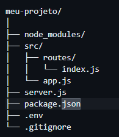

# Meu Primeiro Ambiente Backend com Node.js + Express

## Sobre o Projeto

Este projeto demonstra a construção progressiva de um servidor backend utilizando **Node.js** e **Express**, aplicando boas práticas profissionais como organização em camadas, controle de versão, uso de variáveis de ambiente e estrutura escalável.

O desenvolvimento foi dividido em 7 etapas evolutivas, cada uma com objetivo claro, fluxo definido, resultado esperado e checklist técnico.

1️⃣ Inicialização do Projeto
Criação da estrutura base com Node.js, package.json e instalação do Express.

2️⃣ Criação do Servidor Express
Configuração do servidor HTTP e criação da rota principal /.

3️⃣ Implementação de Rotas
Adição de múltiplos endpoints, incluindo a rota /sobre.

4️⃣ Organização Profissional da Estrutura
Separação em camadas (server.js, app.js, routes/) e modularização.

5️⃣ Configuração de Scripts no package.json
Padronização da execução com npm run dev.

6️⃣ Controle de Versão com Git
Versionamento do projeto com commits e sincronização com repositório remoto.

7️⃣ Configuração de Variáveis de Ambiente (.env)
Proteção de configurações sensíveis utilizando dotenv e .gitignore.

# 🧱 Arquitetura Inicial do Projeto

# ✅ ETAPA 1 — Inicialização do Projeto

## 🎯 Objetivo

Criar a base estrutural do projeto Node e preparar o ambiente de desenvolvimento.

## 🔄 Fluxo

1. Criar diretório do projeto
2. Executar `npm init -y`
3. Instalar dependência Express
4. Criar arquivo principal

## 🎯 Resultado Esperado

Projeto inicializado com `package.json` configurado e dependências instaladas corretamente.

## ✔ Checklist

* [x] Estrutura criada
* [x] npm inicializado
* [x] Express instalado
* [x] Arquivo principal criado

## 🏁 Conclusão

A base técnica foi estabelecida, permitindo iniciar o servidor.

# ✅ ETAPA 2 — Criação do Servidor Express

## 🎯 Objetivo

Configurar servidor HTTP funcional.

## 🔄 Fluxo

1. Importar Express
2. Criar instância da aplicação
3. Definir porta
4. Criar rota `/Sobre`
5. Inicializar com `app.listen()`

## 🎯 Resultado Esperado

Servidor rodando na porta configurada e respondendo requisições HTTP.

## ✔ Checklist

* [x] Servidor configurado
* [x] Porta definida
* [x] Rota principal funcionando
* [x] Teste com navegador/curl realizado

## 🏁 Conclusão

Aplicação passou a responder requisições corretamente.

# ✅ ETAPA 3 — Implementação de Rotas

## 🎯 Objetivo

Demonstrar funcionamento do roteamento com múltiplos endpoints.

## 🔄 Fluxo

1. Criar rota GET `/sobre`
2. Retornar resposta personalizada
3. Validar funcionamento

## 🎯 Resultado Esperado

Servidor respondendo em `https://fuzzy-bassoon-r4prj644pwqjhpxjq-3000.app.github.dev/` e `https://fuzzy-bassoon-r4prj644pwqjhpxjq-3000.app.github.dev/sobre`.

* [x] Nova rota criada
* [x] Teste realizado
* [x] Resposta validada

## 🏁 Conclusão

Sistema preparado para expansão de endpoints.

# ✅ ETAPA 4 — Organização Profissional da Estrutura

## 🎯 Objetivo

Separar responsabilidades e preparar arquitetura escalável.

## 🔄 Fluxo

1. Criar pasta `src`
2. Separar `app.js` e `server.js`
3. Criar pasta `routes`
4. Modularizar exportações

## 🎯 Resultado Esperado

Código organizado em camadas, facilitando manutenção futura.

## ✔ Checklist

* [x] Estrutura modular criada
* [x] Rotas isoladas
* [x] Servidor separado da aplicação
* [x] Aplicação funcionando após refatoração

## 🏁 Conclusão

Projeto estruturado seguindo padrão profissional.

# ✅ ETAPA 5 — Scripts de Execução

## 🎯 Objetivo

Padronizar execução do projeto.

## 🔄 Fluxo

1. Criar script `dev` no package.json
2. Executar via `npm run dev`
3. Validar funcionamento

## 🎯 Resultado Esperado

Servidor iniciado de forma padronizada.

* [x] Script configurado
* [x] Execução validada

## 🏁 Conclusão

Execução do projeto tornou-se automatizada e organizada.

# ✅ ETAPA 6 — Controle de Versão com Git

## 🎯 Objetivo

Versionar a evolução do projeto.

## 🔄 Fluxo

1. Verificar alterações
2. Adicionar arquivos ao stage
3. Criar commits descritivos
4. Realizar push

## 🎯 Resultado Esperado

Histórico versionado e sincronizado com repositório remoto.

## ✔ Checklist

* [x] git status verificado
* [x] git add executado
* [x] commit realizado
* [x] push concluído

## 🏁 Conclusão

Projeto com rastreabilidade e histórico estruturado.

# ✅ ETAPA 7 — Variáveis de Ambiente (.env)

## 🎯 Objetivo

Proteger informações sensíveis e tornar configurações flexíveis.

## 🔄 Fluxo

1. Instalar dotenv
2. Criar `.env`
3. Configurar `process.env`
4. Ignorar `.env` no Git

## 🎯 Resultado Esperado

Configurações externas protegidas e projeto preparado para produção.

* [x] dotenv instalado
* [x] Arquivo .env criado
* [x] Porta configurada via variável
* [x] .env ignorado no Git

## 🏁 Conclusão

Projeto alinhado com boas práticas de segurança e deploy.

# 📊 Evolução Técnica Alcançada

✔ Servidor HTTP funcional
✔ Estrutura modular organizada
✔ Versionamento profissional
✔ Configuração via variáveis de ambiente
✔ Projeto preparado para escalar

# 🚀 Próximas Evoluções

* Implementar rotas POST
* Criar middlewares
* Validar dados de entrada
* Conectar banco de dados
* Estruturar API REST completa
* Deploy em ambiente cloud

# 👨‍💻 Autor

Ruberval Brasileiro 

TDS - Técnico em Desenvolvimento de Sistema
Backend | FrontEnd

# 📌 Status do Projeto

🟢 Em evolução contínua
